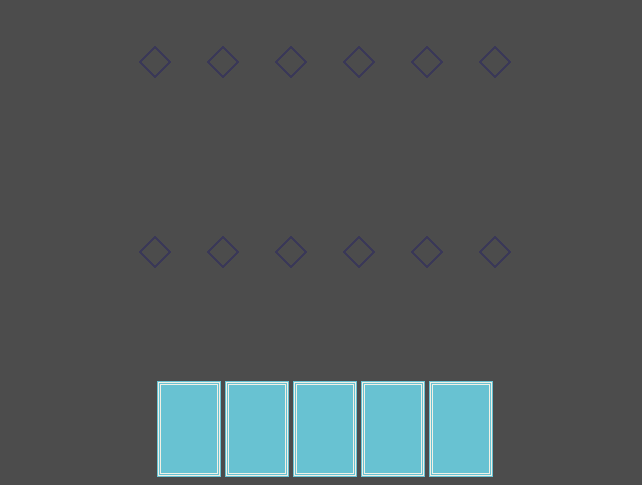

# Sistema de jogo de cartas

Apenas um sistema simples para um jogo de cartas, onde você pode ter uma mão de cartas
selecionar a carta através do mouse e jogar as suas cartas na mesa, feito na godot.

  

